# User guide

A walk through the Organisational Wind Tunnel for someone who has never used it: what you're looking at, how to test a
change, and how to read what comes back. It follows the critical demo from the README — an admin cut — step by step,
then covers every panel and control in the [reference](#reference) section.

> **Read this first.** This is an exploratory simulation of a *synthetic* organisation. It is for thinking through
> second-order effects and dependencies, never for predicting what real people will do or making decisions about them.
> See [LIMITATIONS.md](LIMITATIONS.md).

All screenshots come from the 100-person `prototype` organisation with seed 6 and the rule-based (heuristic) decision
engine — the defaults you get with `./windtunnel.sh`, apart from the seed. They're generated by a script, so they
match the current build: see [Regenerating the screenshots](#regenerating-the-screenshots).

**Contents** — [1. The living organisation](#1-the-living-organisation) ·
[2. Describe a change](#2-describe-a-change) · [3. Check the interpretation](#3-check-the-interpretation) ·
[4. Baseline and intervention](#4-baseline-and-intervention) · [5. Effects](#5-effects) ·
[6. Why did this happen?](#6-why-did-this-happen) · [7. Inspect teams and people](#7-inspect-teams-and-people) ·
[8. Many worlds](#8-many-worlds) · [9. Save, fork and compare engines](#9-save-fork-and-compare-engines) ·
[Reference](#reference) · [Reading results honestly](#reading-results-honestly)

---

## 1. The living organisation

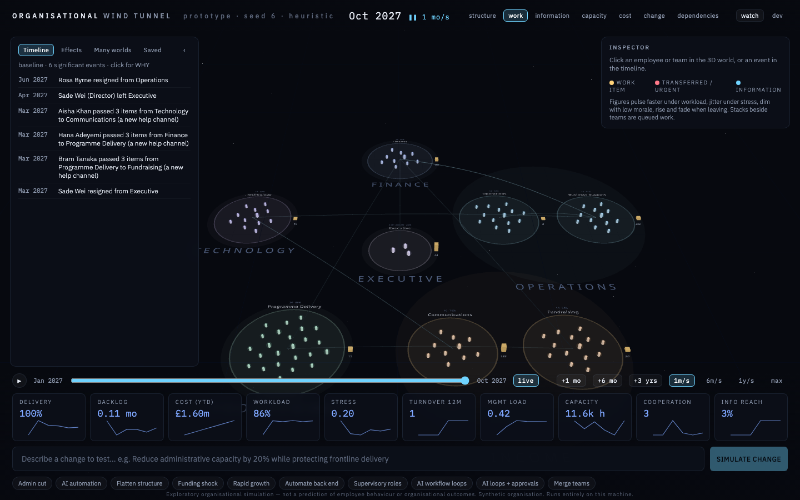

When you open <http://127.0.0.1:5180> you see one organisation running month by month:

* **Districts** (large faint discs with spaced capitals — FINANCE, OPERATIONS…) are departments. **Teams** are the
  rings inside them, labelled with their name, headcount, vacancies and current workload.
* **Each figure is one employee** — a persistent agent with their own skills, workload, stress, morale and memory.
  Figures pulse faster under workload, jitter under stress, dim when morale is low, and rise and fade when they leave.
* **Lines between teams are process paths** (a procurement request goes Business Support → Finance approval → Finance).
  Small moving dots are real work items travelling along them; the **stack beside each team is its queue**, with the
  item count underneath.
* The **timeline** (left) lists significant events as they happen — resignations, new help channels between teams,
  approvals bypassed. Click any of them to ask *why*.
* The **metric tiles** (bottom) show the organisation's vital signs, each with a sparkline.
* Press **▶** or pick a speed (1 m/s = one month per second) to let time run; **+1 mo / +6 mo / +3 yrs** jump ahead.

Nothing has been changed yet: this is the *baseline*, an organisation already doing its normal work with normal churn.

## 2. Describe a change

Type a change in plain English into the box at the bottom, or click one of the scenario chips underneath
(**Admin cut**, **AI automation**, **Flatten structure**, **Funding shock**, **Rapid growth**, four AI-adoption
scenarios and **Merge teams**), then press **SIMULATE CHANGE**.

Things the interpreter understands:

| Kind of change | Examples |
|---|---|
| Cut or grow headcount | *Reduce admin by 20%* · *Cut 5 posts from HR* · *Hire 10 people into technology* · *Double the tech team* |
| Protect a group | *…while protecting frontline delivery* · *…but don't cut frontline* |
| Budgets and funding | *Cut the finance budget by 15%* · *Organisation income falls 15% next year* |
| Demand | *Increase demand by 30% over 6 months* · *Demand for services doubles over two years* |
| Structure | *Merge finance and business support* · *Remove a management layer* · *Freeze hiring in operations* |
| Process | *Remove the approval step from procurement* · *Move to a four-day week* |
| AI adoption | *Automate the back end over a year* · *Deploy AI agents for 60% of back-office work with staff supervising agent teams* · *Let AI run the procurement workflow end to end for 80% of cases* |

You can combine clauses (*Cut admin by 20% and hire 5 people into technology*), give sizes as percentages, fractions
(*a third*) or head counts, and set a transition period (*over 18 months*).

## 3. Check the interpretation

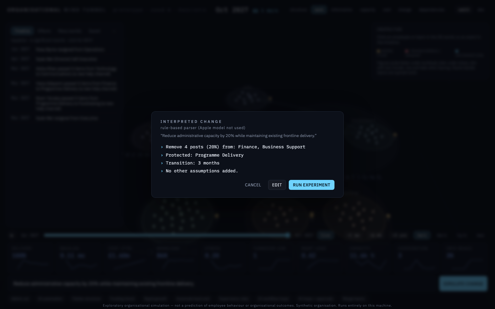

Before anything runs, the **INTERPRETED CHANGE** dialog shows exactly what the simulator is about to do, computed
against *this* organisation: which teams, how many posts, what is protected, over how long — and "No other assumptions
added". Read it. You can **RUN EXPERIMENT**, **EDIT** the plan as JSON, or **CANCEL**.

The interpreter is rule-based by default. If you're on a Mac with Apple Intelligence, the on-device Apple model is
asked as well, and its reading replaces the rules' if it arrives while the dialog is open (the dialog says which one
you're looking at). Either way it only restates the change; it never decides outcomes.

It tells you when it has read something as a constraint rather than a change:

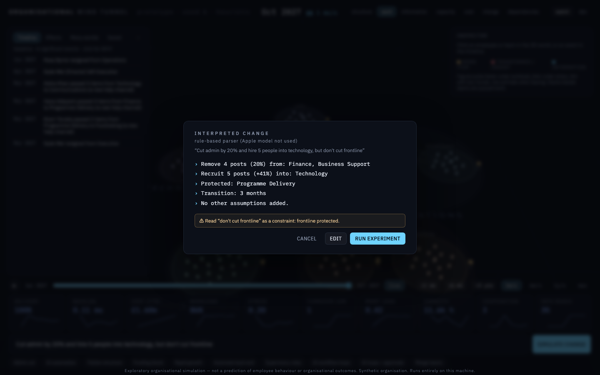

…and it refuses to guess. If nothing in the request maps onto something the simulator can model, you get an
explanation and **RUN EXPERIMENT** stays disabled:

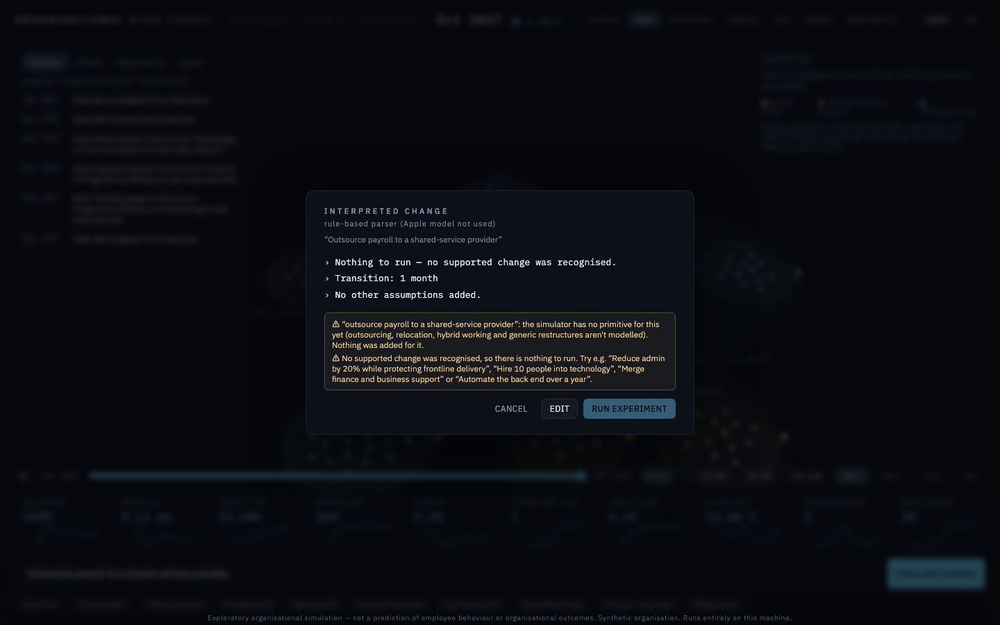

## 4. Baseline and intervention

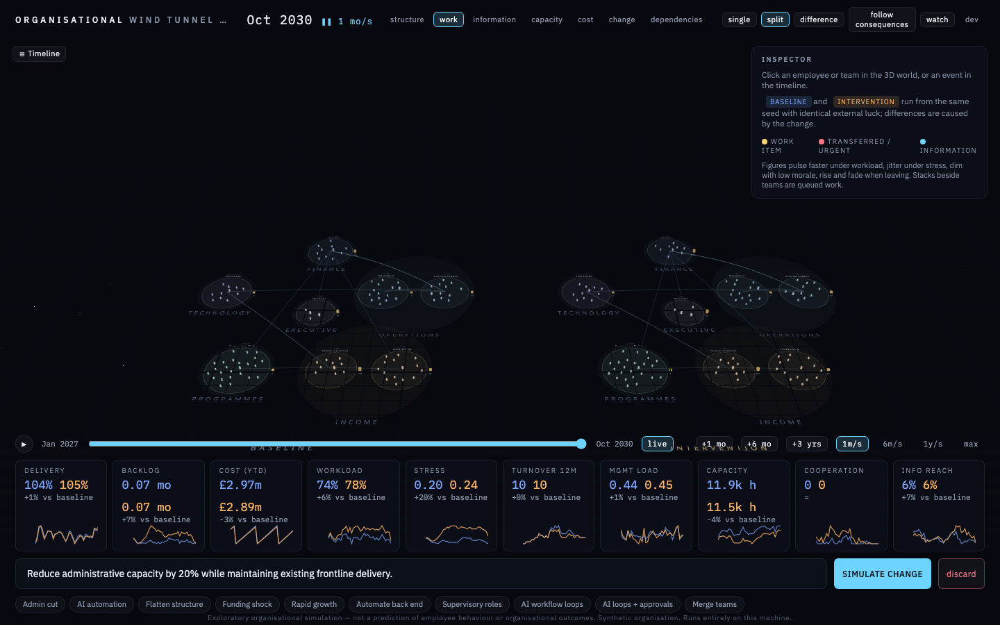

Running the experiment **forks** the organisation. From that month on there are two worlds:

* **BASELINE** (left, blue figures in the tiles): the organisation carrying on unchanged.
* **INTERVENTION** (right, amber): the same organisation, same people, with your change applied.

Both run from the same seed with *common random numbers*: every resignation, absence, incoming request and error that
isn't affected by your change happens identically in both. So **any difference between the two worlds was caused by
the change** — not by luck. Each metric tile shows both values and the difference (*Stress 0.20 · 0.24, +20% vs
baseline*).

Here, three years on, delivery has held up (the cut was "protecting frontline delivery"), stress is 20% higher and
capacity 4% lower. The headline numbers look calm. The interesting part is underneath.

View modes (top right):

* **single** — one world full-screen (a button toggles which).
* **split** — side by side, as above. Hide the left panel with **‹** to give both worlds room.
* **difference** — one world, with an amber ring around each team whose state has diverged from the baseline; the
  wider the ring, the bigger the divergence:

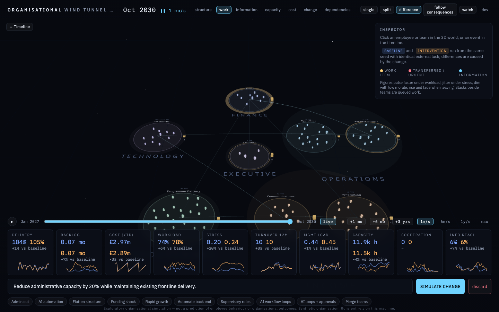

* **follow consequences** — the camera flies to wherever the divergence is currently strongest.
* **watch** — a cinematic mode that hides the panels and captions the biggest current divergence (press `w`).

## 5. Effects

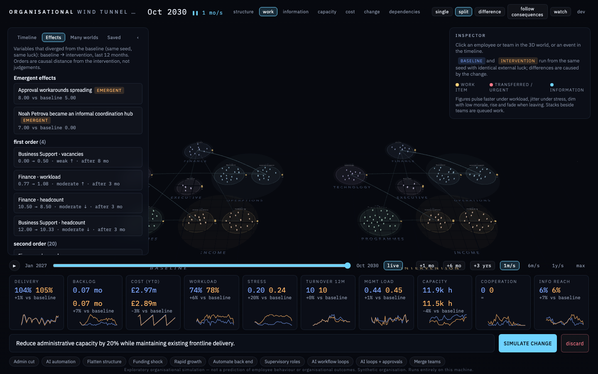

Open **Effects** to see every variable that diverged materially from the baseline over the last 12 months, grouped by
**causal distance** from the change:

* **First order** — direct results of the change itself: Finance and Business Support headcount down.
* **Second order** — what that caused next door: Finance workload up, work dropped in Business Support, items passed to
  other teams.
* **Third order** — further out: here, a shift in Communications turnover.
* **Organisation-wide** — totals across the organisation (these summarise the team rows; they aren't a further step).
* **Emergent effects** at the top are named phenomena the simulator detected from state — *Approval workarounds
  spreading*, *New bottleneck: Finance*, *X became an informal coordination hub*. Nobody scripted them.

Each row reads **baseline → intervention**, a **strength** (weak / moderate / strong / very strong: the difference
relative to the baseline's own month-to-month variation — hover for the number), a direction arrow, and how long after
the change it appeared. **EMERGENT** marks effects on teams that were *not* targeted by the change.

In this run the frontline team the cut was meant to protect — Programme Delivery — ends up dropping requests. That's
the kind of effect this tool exists to surface.

## 6. Why did this happen?

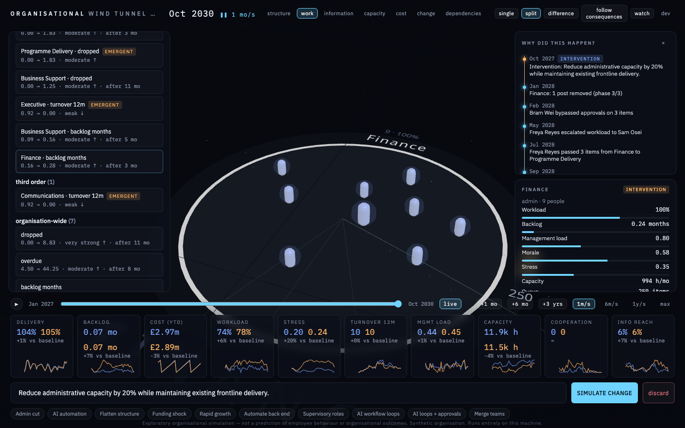

Click an effect (or any timeline event) and the right-hand panel reconstructs its **causal chain** from the event log,
starting at the intervention. Each step is a recorded event — something that happened to someone, or something an
agent decided — with the numbers that changed. Here: the change → a Finance post removed → approvals start being
bypassed under pressure → a Finance officer escalates their workload to the manager → and then starts passing work from
Finance to Programme Delivery. The protected team's extra load is a *consequence of the cut*, arriving by a route nobody planned.

Long chains are folded: repeated steps show a count (×3), and a long middle is summarised as "… N intermediate steps".
If a chain doesn't reach the intervention, the panel says so — that event is probably background churn that happens in
both worlds.

Drag the **time scrubber** back to replay any earlier month (the clock shows **REPLAY**); press **live** to return.

## 7. Inspect teams and people

Click a team ring (or an effect about a team) to open the **team inspector**:

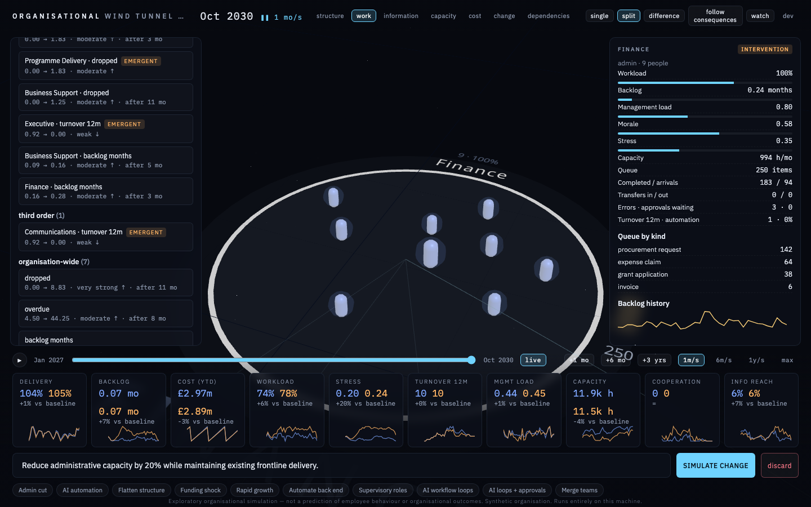

It shows the team's workload, backlog, management load, morale, stress, capacity, what's queued (by kind), transfers
in and out, errors and waiting approvals, turnover, and recent events — each clickable for *why*. Click a member to
open the **employee inspector**:

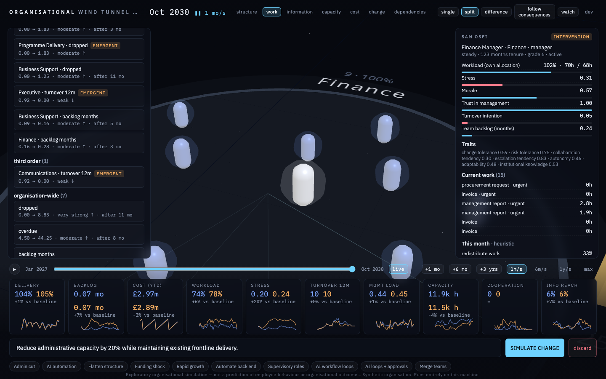

This is one agent's full state: workload against their *own* allocation, stress, morale, trust in management,
turnover intention, traits, the work they're holding, and **this month's decision** — the probability the engine gave
each available action, and what they actually did. **REPLAY DECISIONS** lists their decision history.

People are synthetic. The inspector exists to show *how the model reasons*, not to profile anyone.

## 8. Many worlds

One run is one possible future. **Many worlds** runs the same change across dozens or thousands of organisations with
different seeds (different people, luck and demand), without rendering, and reports what happened how often:

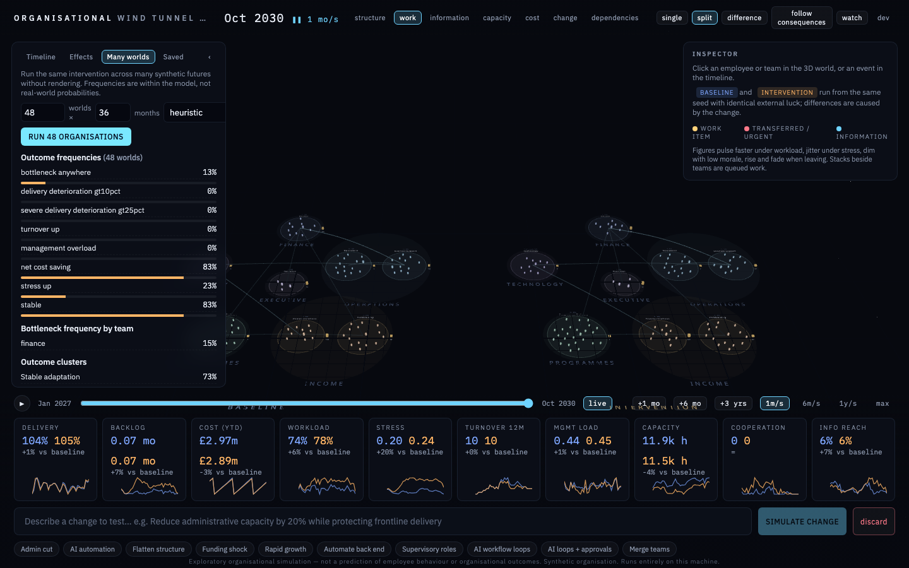

* **Outcome frequencies** — the share of worlds with a bottleneck, delivery down more than 10%, turnover up, a net cost
  saving, and so on.
* **Bottleneck frequency by team** — where the pressure tends to land.
* **Outcome clusters** — worlds grouped by what happened to them (*Stable adaptation*, *Workload-transfer*,
  *Bottleneck*), with shares.
* **Distributions** — p10 · p50 · p90 of key metrics, baseline (blue) against intervention (amber).

Scroll down for **unexpected consequences**: variables far from the change in the organisation graph that moved in
many worlds, with their typical lag. Programme Delivery — the protected team — dominates the list (morale, turnover,
workload, work transferred in):

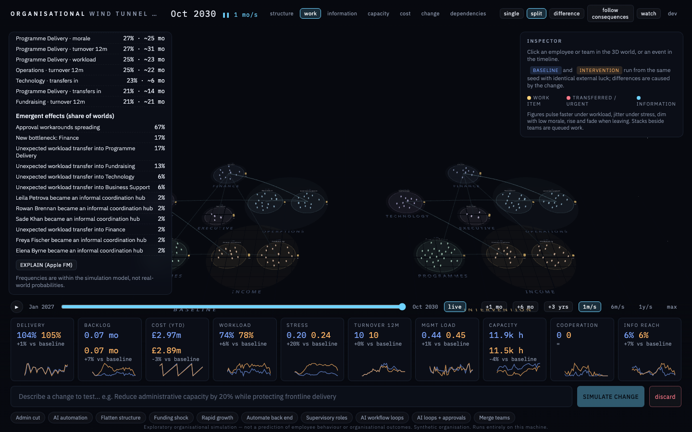

**EXPLAIN** asks the Apple on-device model (if available) for a plain-English summary of the numbers shown. For large
batches, use the command line (`scripts/batch_cli.py`, see the README), which also does sensitivity sweeps.

## 9. Save, fork and compare engines

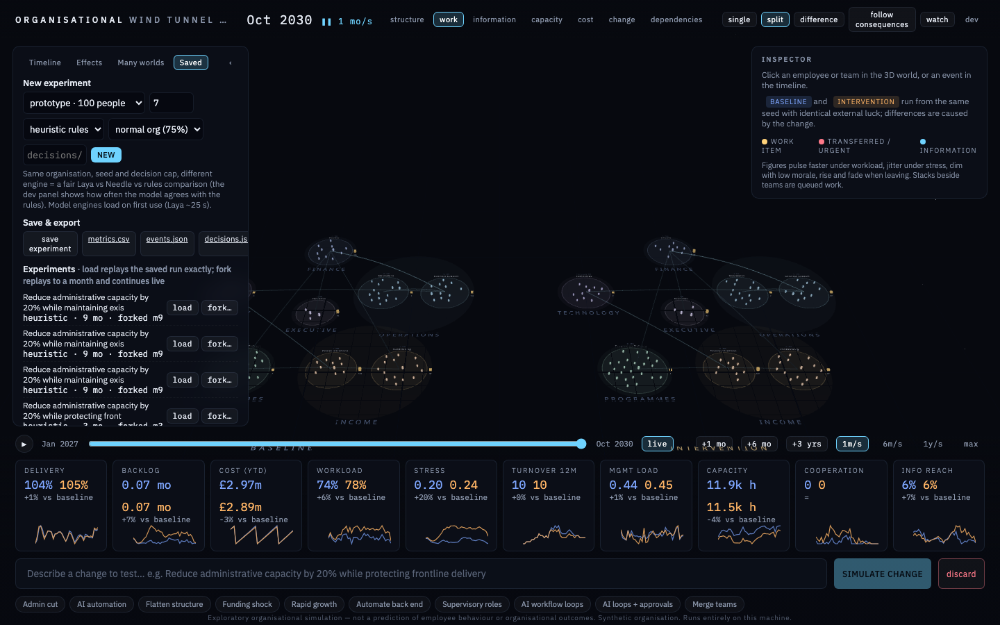

* **New experiment** — choose the organisation (100-person prototype or ~500-person charity), seed, decision engine
  (rules, Laya or Needle), how stretched it starts (slack 65% / normal 75% / lean 85%), and an optional cap on agent
  decisions per month. Same organisation + seed + cap with a different engine is a fair engine comparison.
* **Save & export** — save the experiment to the local SQLite file; download metrics (CSV), events or decisions (JSON).
* **load** replays a saved experiment exactly (recorded decisions); **fork…** replays it to a month you choose and
  continues live from there — e.g. to try a different engine from month 12.

---

## Reference

### Top bar

| Control | What it does |
|---|---|
| Clock | Simulated month; **REPLAY** when you've scrubbed back. ▶/❚❚ and the speed show whether time is running. |
| View modes: **structure · work · information · capacity · cost · change · dependencies** | Change what the 3D world emphasises — see below. |
| **single · split · difference** | Appear once a change is running; see [section 4](#4-baseline-and-intervention). |
| **follow consequences** | Camera tracks the strongest divergence. |
| **watch** (`w`) | Cinematic mode with captions; panels hidden. |
| **dev** (`d`) | Developer diagnostics overlay. |

### View modes

| Mode | Shows |
|---|---|
| **work** (default) | Process paths, moving work items, queue stacks. Figures coloured by department, reddening with stress. |
| **structure** | Everything: work items, information pulses, queues and management-load rings (red when overloaded). |
| **information** | The informal network (who talks to whom) and information packets spreading through it. |
| **capacity** | Teams and people coloured by workload, blue (spare) → red (overloaded); management-load rings. |
| **change** | Highlights people currently doing something other than normal work (escalating, working around, helping). |
| **dependencies** | Emphasises the heaviest process dependencies between teams and management-load rings. |
| **cost** | Hides process paths for an uncluttered view; cost itself is read from the Cost tile and exports. |

### Colours and shapes

| You see | It means |
|---|---|
| Yellow dot | A work item moving between teams |
| Pink/red dot | A transferred or urgent item |
| Blue pulse | Information spreading |
| Stack beside a team | Its queue (number = items) |
| Blue-tinted figure | An AI supervisor (after AI-adoption changes); the team's AI agent pool is drawn beside it |
| Amber ring (difference view) | Divergence from the baseline |
| Inner ring (structure / capacity / dependencies) | Management load; red above 1.1 |

### Metric tiles

| Tile | Meaning |
|---|---|
| Delivery | Frontline work completed ÷ frontline work arriving (3-month trailing). Above 100% = catching up on a backlog. |
| Backlog | Queued hours ÷ monthly capacity, in months of work. |
| Cost (YTD) | Spend so far this year. |
| Workload | Average personal workload (allocated hours ÷ own capacity). |
| Stress | Average stress, 0–1. |
| Turnover 12m | Leavers in the last 12 months. |
| Mgmt load | Share of managers' time in use (line management + approvals + escalations); above 1 = overloaded. |
| Capacity | Human working hours available this month. |
| Cooperation | Work items passed between teams this month. |
| Info reach | How far recent information has spread. |
| AI agents, exceptions, downstream defects, deskilling | Appear once AI is in use; see [AI_SCENARIOS.md](AI_SCENARIOS.md). |

### Time controls

**▶** play/pause · **1m/s · 6m/s · 1y/s · max** speed · **+1 mo · +6 mo · +3 yrs** jump ahead · drag the scrubber to
replay a past month · **live** returns to the present · **discard** throws away the intervention world.

### Keyboard

`w` watch mode · `d` developer panel · `Esc` close inspectors and WHY, leave watch mode.

### Developer panel

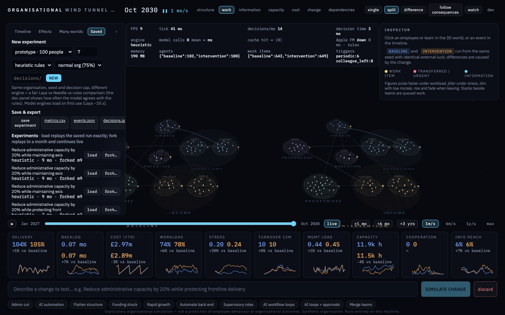

Frame rate, simulation tick time, agent decisions per month and their latency, the engine in use, model calls and
cache hit rate (for Laya/Needle), Apple model status, memory, active agents and work items per world, and which
triggers prompted decisions this month.

---

## Reading results honestly

* **Frequencies are within the model**, not real-world probabilities. "Bottleneck in 22% of worlds" means 22% of these
  synthetic organisations under these assumptions — nothing more.
* **Orders are causal distance, not importance.** A third-order effect can matter more than a first-order one.
* **Emergent means unscripted, not surprising or bad.** It marks effects on teams the change didn't touch.
* **Strength is relative to normal variation.** A "very strong" effect on a quiet metric can still be small in absolute
  terms — read the before → after values.
* **Parameters are plausible, not measured.** When a result hinges on one (slack, supervision cost), sweep it:
  `scripts/batch_cli.py --sweep target_utilisation=0.65,0.75,0.85`.
* **Use it to ask better questions**, not to answer them. The best output is usually "we hadn't thought about what
  happens to X" — then go and find out in the real organisation.

## Regenerating the screenshots

The images in `docs/images/` are produced by a Playwright script that drives the real app through this guide
(`frontend/docs-shots/guide.spec.ts`). After UI changes:

```bash
cd frontend
WINDTUNNEL_APPLE_FM=0 npm run docs:screenshots
```

`WINDTUNNEL_APPLE_FM=0` keeps the dialogs on the default rules-only path. The script starts the app itself if nothing
is listening on :5180; if the app is already running, it uses that (and whatever Apple model setting it was started
with). It takes about two minutes, most of it the 48-world batch.
